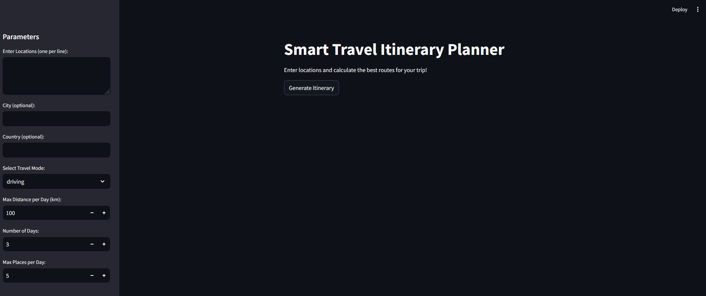

# Smart Travel Itinerary Planner [Work In Progress]



Smart Travel Itinerary Planner is a personal project designed to help you plan the best routes for your trips. Enter your desired locations, and the app will calculate the optimal route and split it into daily itineraries.

## Features

- Geocode locations using the Nominatim API
- Calculate the optimal route using the A* algorithm
- Split the route into daily itineraries based on user-defined parameters
- Visualize the route on an interactive map
- Download the itinerary as a JSON file

## Requirements

- Python 3.7+
- The following Python packages (listed in `requirements.txt`):
  - streamlit
  - requests
  - folium
  - streamlit_folium
  - other dependencies...

## Installation

1. Clone the repository:
    ```sh
    git clone https://github.com/yourusername/smart-travel-itinerary-planner.git
    cd smart-travel-itinerary-planner
    ```

2. Create a virtual environment and activate it:
    ```sh
    python3 -m venv venv
    source venv/bin/activate
    ```

3. Install the required packages:
    ```sh
    pip install -r requirements.txt
    ```

## Usage

1. Run the Streamlit app:
    ```sh
    streamlit run src/app.py
    ```

2. Open your web browser and go to `http://localhost:8501`.

3. Enter your desired locations, city, and country in the sidebar.

4. Set your travel parameters (travel mode, max distance per day, number of days, max places per day).

5. Click the "Generate Itinerary" button to calculate the optimal route and view it on the map.

6. Download the itinerary as a JSON file if desired.

## Project Structure

- [app.py](http://_vscodecontentref_/1): Main application code
- [requirements.txt](http://_vscodecontentref_/2): List of required Python packages

## License

This project is for personal use and self-learning purposes only. No license is provided.
